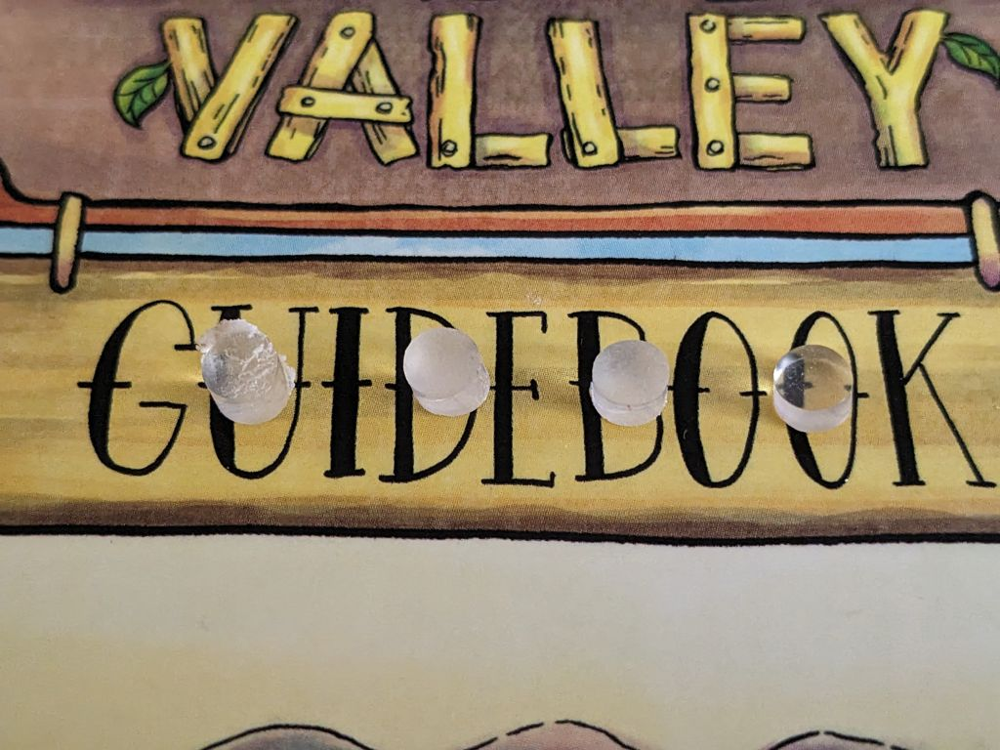
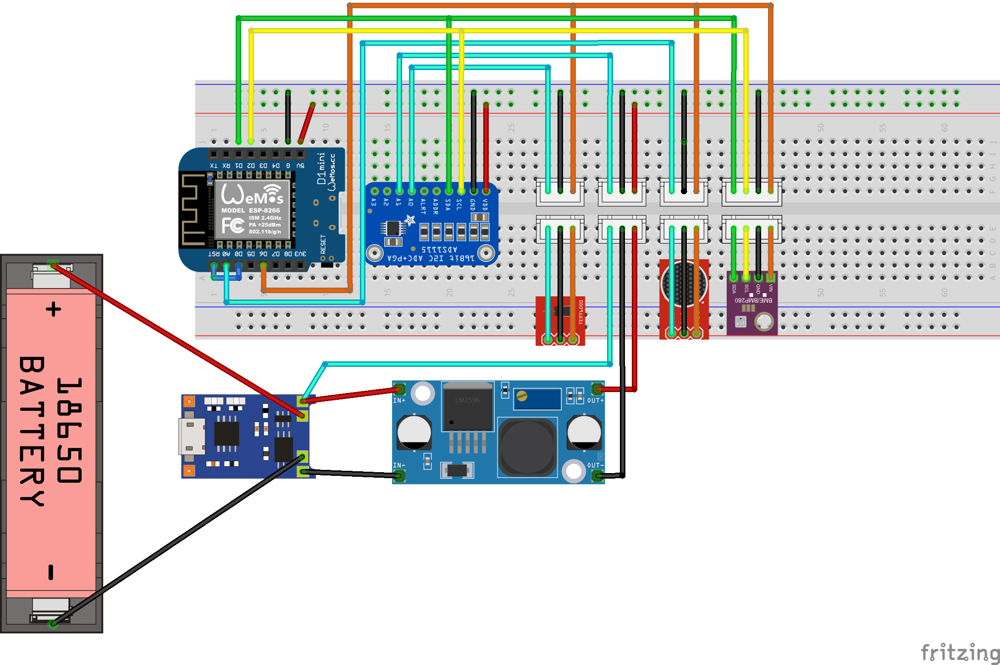
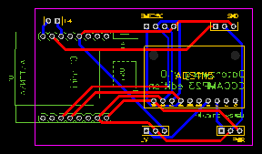
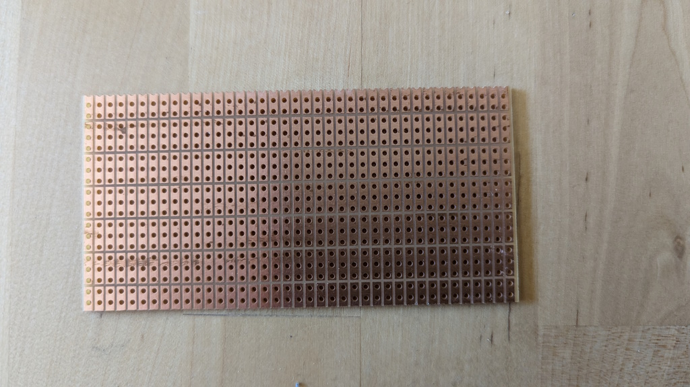
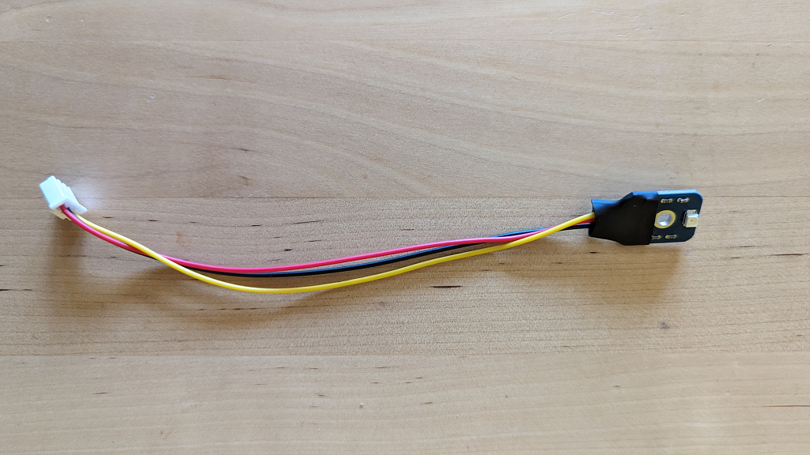
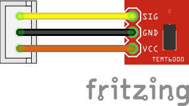
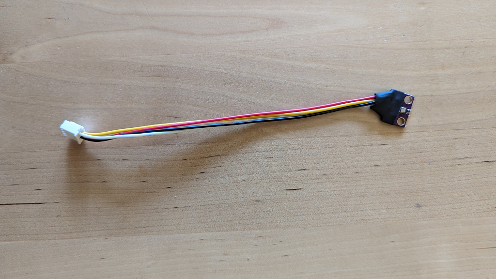
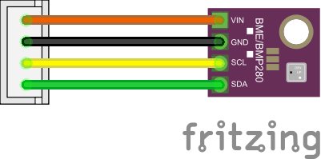
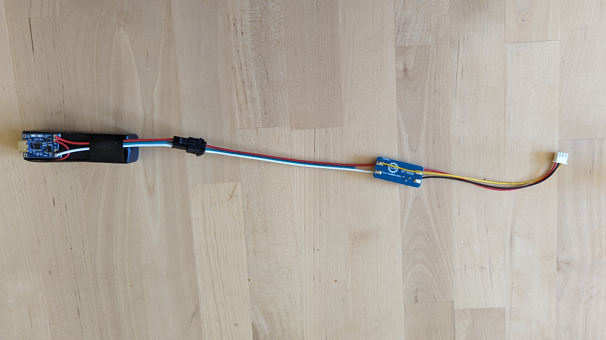
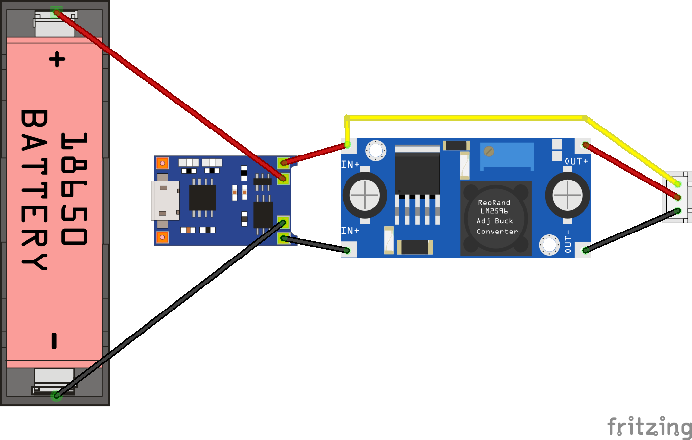

# How to build a Datenzwerg

!!! warning
    
    Der Datenzwerg wurde für das [CCCamp23](https://events.ccc.de/camp/2023/infos/) entwickelt. Hardware, Firmware und Modelle wurden für einen bestimmten Zweck und eine bestimmte Nutzungsdauer entwickelt und sind möglicherweise nicht für andere Anwendungsfälle geeignet. Der Datenzwerg wird wie er ist ohne jegliche Garantie, Pläne zur Verbesserung oder Behebung oder andere Unterstützung bereitgestellt. Wenn du deinen eigenen Datenzwerg bauen möchtest, bist du auf dich allein gestellt.

## Voraussetzungen

Einen Datenzwerg zu bauen erfordert etwas Löterfahrung und 3D-Druckkenntnisse.

Die Firmware, die für den Datenzwerg zur Verfügung gestellt wird, erfordert, dass du ihr Zugangsdaten für ein vorhandenes WiFi-Netzwerk (SSID und Passwort) und auch Zugang zu einer InfluxDB2-Instanz (Host, Port, Organisations-ID, Bucket-Name und schreibfähiges Zugriffstoken) zur Verfügung stellst. Du musst diese Zugangsdaten in einer Datei namens secrets.yaml im Verzeichnis firmware angeben. Eine Vorlage für diese Datei findest du in firmware/secrets-template.yaml.

## Teile

### Elektronik

Um deinen eigenen Datenzwerg zu bauen, benötigst du folgende Teile:

| Menge | Teil | Funktion | Link | Preis |
| ----- | ---- | -------- | ---- | ----- |
| 1     | Wemos D1 Mini | MCU | [AliExpress](https://aliexpress.com/item/1005004967205772.html) | ~1.70€ |
| 1     | BME280 | Environment Sensor | [AliExpress](https://aliexpress.com/item/1005003676342598.html) | ~2.30€ |
| 1     | TP4056 | Lipo Charger | [AliExpress](https://aliexpress.com/item/32624444293.html) | ~0.50€ |
| 1     | VEML6075 | UV Sensor | [AliExpress](https://aliexpress.com/item/1005004653958045.html) | ~3.00€ |
| 1     | ADS1115 | 4 Port ADC | [AliExpress](https://aliexpress.com/item/32817162654.html) | ~1.70€ |
| 1     | GY-MAX4466 | Sound sensor | [Amazon](https://www.amazon.de/dp/B07YDG3VZF) | ~1.90€ |
| 1     | 5V MT3608 boost converter | Power supply | [AliExpress](https://de.aliexpress.com/item/4001066566291.html) | ~0,40€ |
| 1     | 18650 LiPo battery | Power source | (WIP) | (on hand)[^1] |
| 1     | 18650 LiPo battery holder | Battery holder | [Amazon](https://www.amazon.de/dp/B08Y5R63YB) | ~0.64€ |
| 3     | male 3-pin JST connectors + cables | Sensor & power connectors | [Amazon](https://www.amazon.de/gp/product/B08ZJ6JGB5) | ~0,30€ |
| 1     | male 4-pin JST connectors + cables | I2C connector | [Amazon](https://www.amazon.de/gp/product/B09LCRCTQG) | ~0,20€ |
| 1     | male 2-pin JST cable male + JST cable female | Battery cable | [Amazon](https://www.amazon.de/GTIWUNG-Steckverbinder-Pin-Verbindungsstecker-Connector-Kabeldraht/dp/B07VYR7J49) | ~0,59€ |
| 1     | perfboard | Soldering board | [Amazon](https://www.amazon.de/gp/product/B085WJCRX8/) | ~0,80€ |

Zusätzlich benötigst du einen Lötkolben, Lötzinn, Litze und Schrumpfschlauch.

!!! warning
    
    Wir benutzen einen BM**E** sensor. Diese werden oft mit den BM**P** sensoren verwechselt. Diesen fehlt aber der Sensor für Luftfeuchte. Du kannst dein Modul mit der Hilfe [dieser Seite](https://homematic-forum.de/forum/viewtopic.php?t=68558) identifizieren.

!!! note

    Wir empfehlen, alle Teile der BOM zu verwenden. Wenn du jedoch etwas Geld sparen möchtest, kannst du die Sensoren direkt an das Board löten, und so das Geld für die JST Verbinder sparen. Du kannst auch den TP4056 weg lassen und die Kabel direkt an den LiPo löten. Sei jedoch gewarnt, dass das Modul Undervoltage-Schutz für den LiPo bereit stellt.

### Zwergenkörper

Wenn du die Elektronik in einen Zwergenkörper bauen willst, benötigst du folgende Teile:

| Anzahl | Teil | Funktion | Link | Preis |
| ----- | ---- | -------- | ---- | ----- |
| 1 | 3D printed gnome body top | Gnome body | [Download](https://raw.githubusercontent.com/romses/Datenzwerg/main/models/datenzwerg_40p_1.2mm_top.stl) | ~3€[^2] |
| 1 | 3D printed gnome body bottom | Gnome body | [Download](https://raw.githubusercontent.com/romses/Datenzwerg/main/models/datenzwerg_40p_1.2mm_bottom.stl) | ~0.80€[^2] |
| 6 | 6x1mm neodymium disc magnets | Connecting the top and bottom of the gnome body | [Amazon](https://www.amazon.de/dp/B007JTKX3Y) | ~1.85€ |
| 1 | ~3mm thick sanded and polished cut-off of a 5mm rod of 0A070GT Plexiglas XT | UV transmissive rain cover for the UV sensor | [Sample from the manufacturer](https://www.plexiglas-shop.com/en-de/products/plexiglas-xt/sr0a070gt.html) | ~0.09€ |

Für den Zusammenbau benötigst du Heißkleber, Sekundenkleber und UV reaktives Harz.

!!! note

    Es wird dringend empfohlen, den Zwergenkörper mit einer 0.6mm Düse und einer Schichthöhe von 0.4mm zu drucken. Das Modell wurde speziell für diese Parameter entworfen und möglicherweise kommt es zu unerwünschten Ergebnissen, wenn eine andere Düsengröße oder Schichthöhe verwendet wird.

    Mit diesem Setup werden die Modelle mit 3 Wänden und 3 Top/Bottom-Layers sowie 20% Infill gedruckt und Tree-Supports gedruckt. Das Drucken des Oberteils sollte ca. 5 Stunden dauernd, das Unterteil etwa eine Stunde.

!!! note

    Wir konnten ein 100mm Sample des XT Plexiglasstabes für etwa 3€ bekommen. Wir haben einen Dremel und [dieses 3D-gedruckte Schneidetool](https://www.printables.com/model/113887-rod-and-tube-cutter-for-dremel-with-limiter) genutzt, um den Stab zuzuschneiden, dann wurde der Abschnitt mit 240er und 400er Körnung glatt geschmirgelt und mit einer Universalpoliturpaste poliert ("Elsterglanz")[^3].

    

## Zusammenbau

### Mainboard

!!! todo

    Übersetzen

The mainboard is the hardest part to assemble. We recommend to first wire up the 3V3 power trail (orange in the Fritzing drawing) and the GND connections (black), then the I2C trail (green and yellow).
Those are the most complex traces. Next do the 5V connections (red) and finally the analogue signals (cyan).



The Fritzing schematic shows the ESP in its original orientation. However, we decided to mount the ESP flipped over. The diagram also shows the ADS1115 in a rotated orientation. This makes the fritzing 
diagram much easier to understand.

{: style="width:100%"}

The PCB schematic shows the ESP in the correct orientation as well as the ADS1115. This schematic is much closer to our hand soldered boards than shown in the Fritzing diagram.


!!! note
    
    We used a special kind of perfboard. The grouping of three pin holes makes organising the wires so much easier.
    
    

Once you are done soldering up the mainboard, we recommend covering the underside in wide strips of Kapton tape to prevent shorts. Alternatively you may use electric tape.

!!! note

    Things to check after soldering:

    - UV sensor, BME280 and sound sensor are powered by 3V3 coming from the ESP.
    - ADS1115 and ESP are powered by 5V coming from the power supply module.
    - All GNDs are connected.
    - No shorts between any of the pins, especially between neighbouring pins bridges can quickly happen. Use a multimeter to check for shorts.

### Sensoren

#### UV- und Schallsensor

Die UV- und Schallsensoren werden an JST Verbindungskabel gelötet, um die Sensoren austauschbar zu machen. Stelle das Potentiometer auf der Rückseite des Schallsensors (vorsichtig!) auf die linke (im Uhrzeigersinn) Position ein, das setzt den Verstärkungsfaktor auf 25x, was der Firmware entspricht. Verpacke die Lötstellen in  Schrumpfschlauch, um sie zu schützen und die Wahrscheinlichkeit von Kurzschlüssen zu verringern.




#### BME280

!!! todo

    Übersetzen

The BME280 sensor is soldered to a 4-pin JST header. Apply shrink tube to protect the soldering joints and reduce the likelihood of shorts. 




!!! note
    
    The temperature inside the Datenzwerg can become much warmer than the outside temperature. We found that even sticking the BME280 outside of the Datenzwerg, by pushing it through the slot on the bottom of the top of the Datenzwerg case, the temperature readings were still extremely high when the Datenzwerg was in direct sunlight, possibly due to radiation of the heated up plastic of the Datenzwerg body. We decided to live with this issue and just note it in the documentation. A different case design could possibly solve this issue.

### Stromversorgnung

!!! todo

    Übersetzen

The Power supply is the second complex component of the Datenzwerg.

In our original design it was intended to charge the LiPos directly via the TP4056 modules. However, tests have shown that these modules become very hot during charging - we measured up to 86°C, and that was too high for us to
feel good about charging them this way on the possibly very dry field of the CCCamp.

Therefore, we charge the LiPos externally in an off-the-shelf LiPo charger. We however kept the modules to prevent deep discharge.

The BAT+ and BAT- terminals are connected to VIN+ and VIN- of boost converters set to 5V output voltage. Both the ADS1115 and the ESP8266 could be operated with 3V3. However, the TP4056 module supplies battery voltage. Therefore, the easiest way was to boost the voltage to 5V using a boost converter to power both the ESP8266 and the ADS1115. This has also the added advantage of allowing us to measure the battery voltage using the ADS1115, which is able to measure voltages up to Vcc + 0.3V. We therefore connected the third wire of the 3-pin JST header used for the connection to the mainboard to VIN+, with the other two wires connected to VOUT+ and VOUT-.

Shrink tube is applied to protect the soldering joints and reduce the likelihood of shorts.





### Zwergenkörper

Klebe die Magnete mit Sekundenkleber in die Löcher im Boden des Zwergenkörpers. Achte auf die richtige Polarität, d.h. die Magnete ziehen sich gegenseitig an, wenn Ober- und Unterteil aufeinander gesetzt werden. Die Magnete sollten bündig mit der Oberfläche des Zwergenkörpers abschließen.

Stecke den Acryl-Regenschutz in das obere der beiden Löcher und halte ihn von hinten mit dem Finger fest. Wenn sie nicht sofort passt, sleife das Loch im Druck vorsichtig größer, bis er passt. Er sollte bündig mit der Innenseite des Zwergenkörpers abschließen, es ist in Ordnung, wenn er auf der Vorderseite ein wenig übersteht. Achte unbedingt darauf auf, dass kein UV-Resin auf die Oberfläche der Acrylscheibe gelangt. Das UV-Resin darf nur auf die Ränder kommen. Härte es dann mit einer UV-Lampe aus.

!!! warning

    Achte darauf, dass kein UV-Resin auf die Oberfläche der Acrylscheibe gelangt. Wenn das passiert, wird sie dauerhaft getrübt sein.

Verwende einen kleinen Schraubenzieher oder ein anderes Werkzeug um den UV-Sensor an seinem Schrumpfschlauch festzuhalten. Klebe Heißkleber auf den Schrumpfschlauch und befestige den Sensor an seinem Platz so dass der eigentliche Sensor im Zentrum des Acrylfensters zu sehen ist.

Klebe Heißkleber auf den Schrumpfschlauch des BME Sensors und klebe diesen an seinen Platz neben dem Schlitz im unteren Bereich des Oberteils, mit dem Sensor nach unten zeigend.

## Flashen der Firmware

Vergewissere Dich, dass die Stromzufuhr zur Hauptplatine des Datenzwergs unterbrochen ist. Ziehe den D1 mini von der Hauptplatine ab und schließe ihn über USB an den Computer an.

!!! warning
    Das Mainboard verbinder D0 mit RST. So Lange diese beiden Pins miteinander verbunden sind, lässt sich der ESP nicht flashen.
 
Installiere Python 3.11. Clone das [GitHub repository](https://github.com/romses/Datenzwerg) und führe folgende Schritte aus:

1. `python -m venv venv`
2. `source venv/bin/activate`
3. `pip install -r requirements.txt`

Dadurch werden alle Abhängigkeiten, die zum Erstellen der Firmware und der Dokumentation erforderlich sind, in einer virtuellen Umgebung installiert und aktiviert.

Wechsel dann in das Verzeichnis `firmware`. Kopieren die secrets-template.yaml nach secrets.yaml und gib Deine WiFi- und InfluxDB2-Anmeldedaten ein. Führedann

```
esphome -s name <gnome> run datenzwerg.yaml
```

um die Firmware für den Datenzwerg mit dem Namen <gnome> zu kompilieren und zu flashen (wenn z.B. die Firmware für den Zwerg mit dem Namen `zwerg` geflashet werden soll, führe `esphome -s name zwerg datenzwerg.yaml` run aus).

Stecke den D1 mini wieder in die Hauptplatine und schließe ihn wieder an die Stromversorgung an. Es sollte sich mit dem WiFi verbinden und Daten an die konfigurierte InfluxDB senden.

[^1]: Wir haben die Lipos aus alten Powerbanks recycled
[^2]: Unter Annahme eines Filamentpreises von 20€/kg und den empfohlenen Druckeinstellungen, welche in etwa 150g Filament für den Druck des Oberteils und 40g für das Unterteil resultieren, kostet ein Zwergenkörper etwa 4€.
[^3]: Das geht am einfachsten, indem die Scheibe mit einer Zange festhalten wird. Zum Schleifen drücke die Scheibe gegen einen Schwingschleifer auf der niedrigsten Stufe und mit der richtigen Körnung. Zum Polieren reibe die Scheibe immer wieder von Hand auf einem Mikrofasertuch mit aufgetragener Polierpaste ab. Vergiss nicht, beide Seiten zu bearbeiten!
