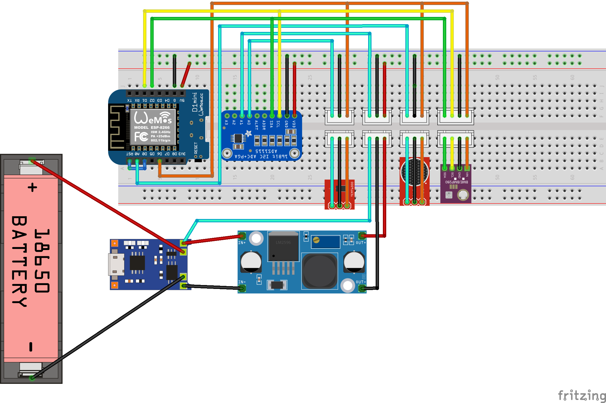

# How to build a Datenzwerg

!!! warning
    
    Der Datenzwerg wurde für das [CCCamp23](https://events.ccc.de/camp/2023/infos/) entwickelt. Hardware, Firmware und Modelle wurden für einen bestimmten Zweck und eine bestimmte Nutzungsdauer entwickelt und sind möglicherweise nicht für andere Anwendungsfälle geeignet. Der Datenzwerg wird wie er ist ohne jegliche Garantie, Pläne zur Verbesserung oder Behebung oder andere Unterstützung bereitgestellt. Wenn du deinen eigenen Datenzwerg bauen möchtest, bist du auf dich allein gestellt.

## Voraussetzungen

Einen Datenzwerg zu bauen erfordert etwas Löterfahrung und 3D-Druckkenntnisse.

Die Firmware, die für den Datenzwerg zur Verfügung gestellt wird, erfordert, dass du ihr Zugangsdaten für ein vorhandenes WiFi-Netzwerk (SSID und Passwort) und auch Zugang zu einer InfluxDB2-Instanz (Host, Port, Organisations-ID, Bucket-Name und schreibfähiges Zugriffstoken) zur Verfügung stellst. Du musst diese Zugangsdaten in einer Datei namens secrets.yaml im Verzeichnis firmware angeben. Eine Vorlage für diese Datei findest du in firmware/secrets-template.yaml.

## Teile

### Elektronik

Um deinen eigenen Datenzwerg zu bauen, benötigst du folgende Teile:

| Menge | Teil | Funktion | Link | Preis |
| ----- | ---- | -------- | ---- | ----- |
| 1     | Wemos D1 Mini | MCU | [AliExpress](https://aliexpress.com/item/1005004967205772.html) | ~1.70€ |
| 1     | BME280 | Environment Sensor | [AliExpress](https://aliexpress.com/item/1005003676342598.html) | ~2.30€ |
| 1     | TP4056 | Lipo Charger | [AliExpress](https://aliexpress.com/item/32624444293.html) | ~0.50€ |
| 1     | VEML6075 | UV Sensor | [AliExpress](https://aliexpress.com/item/1005004653958045.html) | ~3.00€ |
| 1     | ADS1115 | 4 Port ADC | [AliExpress](https://aliexpress.com/item/32817162654.html) | ~1.70€ |
| 1     | GY-MAX4466 | Sound sensor | [Amazon](https://www.amazon.de/dp/B07YDG3VZF) | ~1.90€ |
| 1     | 5V MT3608 boost converter | Power supply | [AliExpress](https://de.aliexpress.com/item/4001066566291.html) | ~0,40€ |
| 1     | 18650 LiPo battery | Power source | (WIP) | (on hand)[^1] |
| 1     | 18650 LiPo battery holder | Battery holder | [Amazon](https://www.amazon.de/dp/B08Y5R63YB) | ~0.64€ |
| 3     | male 3-pin JST connectors + cables | Sensor & power connectors | [Amazon](https://www.amazon.de/gp/product/B08ZJ6JGB5) | ~0,30€ |
| 1     | male 4-pin JST connectors + cables | I2C connector | [Amazon](https://www.amazon.de/gp/product/B09LCRCTQG) | ~0,20€ |
| 1     | male 2-pin JST cable male + JST cable female | Battery cable | [Amazon](https://www.amazon.de/GTIWUNG-Steckverbinder-Pin-Verbindungsstecker-Connector-Kabeldraht/dp/B07VYR7J49) | ~0,59€ |
| 1     | perfboard | Soldering board | [Amazon](https://www.amazon.de/gp/product/B085WJCRX8/) | ~0,80€ |

Zusätzlich benötigst du einen Lötkolben, Lötzinn, Litze und Schrumpfschlauch.

!!! warning
    
    Wir benutzen einen BM**E** sensor. Diese werden oft mit den BM**P** sensoren verwechselt. Diesen fehlt aber der Sensor für Luftfeuchte. Du kannst dein Modul mit der Hilfe [dieser Seite](https://homematic-forum.de/forum/viewtopic.php?t=68558) identifizieren.

!!! note

    Wir empfehlen, alle Teile der BOM zu verwenden. Wenn du jedoch etwas Geld sparen möchtest, kannst du die Sensoren direkt an das Board löten, und so das Geld für die JST Verbinder sparen. Du kannst auch den TP4056 weg lassen und die Kabel direkt an den LiPo löten. Sei jedoch gewarnt, dass das Modul Undervoltage-Schutz für den LiPo bereit stellt.

### Zwergenkörper

Wenn du die Elektronik in einen Zwergenkörper bauen willst, benötigst du folgende Teile:

| Anzahl | Teil | Funktion | Link | Preis |
| ----- | ---- | -------- | ---- | ----- |
| 1 | 3D printed gnome body top | Gnome body | [Download](https://raw.githubusercontent.com/romses/Datenzwerg/main/models/datenzwerg_40p_1.2mm_top.stl) | ~3€[^2] |
| 1 | 3D printed gnome body bottom | Gnome body | [Download](https://raw.githubusercontent.com/romses/Datenzwerg/main/models/datenzwerg_40p_1.2mm_bottom.stl) | ~0.80€[^2] |
| 6 | 6x1mm neodymium disc magnets | Connecting the top and bottom of the gnome body | [Amazon](https://www.amazon.de/dp/B007JTKX3Y) | ~1.85€ |
| 1 | ~3mm thick sanded and polished cut-off of a 5mm rod of 0A070GT Plexiglas XT | UV transmissive rain cover for the UV sensor | [Sample from the manufacturer](https://www.plexiglas-shop.com/en-de/products/plexiglas-xt/sr0a070gt.html) | ~0.09€ |

Für den Zusammenbau benötigst du Heißkleber, Sekundenkleber und UV reaktives Harz.

!!! note

    Es wird dringend empfohlen, den Zwergenkörper mit einer 0.6mm Düse und einer Schichthöhe von 0.4mm zu drucken. Das Modell wurde speziell für diese Parameter entworfen und möglicherweise kommt es zu unerwünschten Ergebnissen, wenn eine andere Düsengröße oder Schichthöhe verwendet wird.

    Mit diesem Setup werden die Modelle mit 3 Wänden und 3 Top/Bottom-Layers sowie 20% Infill gedruckt und Tree-Supports gedruckt. Das Drucken des Oberteils sollte ca. 5 Stunden dauernd, das Unterteil etwa eine Stunde.

!!! note

    Wir konnten ein 100mm Sample des XT Plexiglasstabes für etwa 3€ bekommen. Wir haben einen Dremel und [dieses 3D-gedruckte Schneidetool](https://www.printables.com/model/113887-rod-and-tube-cutter-for-dremel-with-limiter) genutzt, um den Stab zuzuschneiden, dann wurde der Abschnitt mit 240er und 400er Körnung glatt geschmirgelt und mit einer Universalpoliturpaste poliert ("Elsterglanz")[^3].

    

## Zusammenbau

### Mainboard

!!! todo

    Übersetzen

Das Mainboard ist der schwierigste Teil des Zusammenbaus. Wir empfehlen, zuerst die 3V3 Stromversorgung (orange im Fritzing-Schaltplan) und die GND Verbindungen (schwarz) zu verdrahten, dann die I2C Verbindung (grün und gelb).

Das sind die kompliziertesten Verbindungen. Als nächstes die 5V Verbindungen (rot) und schließlich die analogen Signale (cyan).



Der Fritzing-Schaltplan zeigt den ESP in seiner Standardorientierung. Wir haben uns jedoch entschlossen, den ESP umzuwenden. Das Diagramm zeigt auch den ADS1115 in einer gedrehten Orientierung. Dies macht das Fritzing-Diagramm viel einfacher zu verstehen.

{: style="width:100%"}

Die PCB-Skizze zeigt den ESP und den ADS1115 in der korrekten Orientierung. Diese Skizze ist viel näher an unseren handgelöteten Platinen als im Fritzing-Diagramm gezeigt.


!!! note
    
    Wir haben eine spezielle Art von Lochraster verwendet. Die Gruppierung von jeweils drei Löchern erleichtert die Organisation der Kabel erheblich.
    
    

Sobald du das Mainboard verlötet hast, empfehlen wir, die Unterseite in breiten Streifen mit Kaptonband abzudecken, um Kurzschlüsse zu vermeiden. Alternativ kannst du auch Isolierband verwenden.

!!! note

    Dinge, die nach dem Löten zu überprüfen sind:

    - UV-Sensor, BME280 und Soundsensor werden mit 3V3 vom ESP versorgt.
    - ADS1115 und ESP sind mit 5V von der Stromversorgung versorgt.
    - Alle GNDs sind verbunden.
    - Keine Kurzschlüsse zwischen den Pins, insbesondere zwischen benachbarten Pins, Brücken können schnell entstehen. Verwende ein Multimeter, um Kurzschlüsse zu überprüfen.

### Sensoren

#### UV- und Schallsensor

Die UV- und Schallsensoren werden an JST Verbindungskabel gelötet, um die Sensoren austauschbar zu machen. Stelle das Potentiometer auf der Rückseite des Schallsensors (vorsichtig!) auf die linke (im Uhrzeigersinn) Position ein, das setzt den Verstärkungsfaktor auf 25x, was der Firmware entspricht. Verpacke die Lötstellen in  Schrumpfschlauch, um sie zu schützen und die Wahrscheinlichkeit von Kurzschlüssen zu verringern.


#### BME280

Der BME280 Sensor wird an einen 4-poligen JST Verbinder gelötet. Verwende Schrumpfschlauch, um die Lötstellen zu schützen und die Wahrscheinlichkeit von Kurzschlüssen zu verringern.


!!! note

    Die Temperatur im Inneren des Datenzwergs kann sehr viel wärmer werden als die Außentemperatur. Wir haben festgestellt, dass die Temperaturmessungen bei direkter Sonneneinstrahlung selbst dann noch erhöht waren, wenn wir den Sensor durch den Schlitz im Datenzwerggehäuse nach außen verlegt haben, möglicherweise aufgrund der Abwärme des erhitzten Gehäuses selbst. Wir haben uns entschieden, mit diesem Problem zu leben und es einfach in der Dokumentation zu erwähnen. Ein anderes Gehäusedesign könnte dieses Problem möglicherweise lösen.

### Stromversorgnung

Die Stromversorung ist die zweite komplexe Komponente des Datenzwergs.

In unserem ursprünglichen Design war es der Plan, die LiPos direkt mittels der verbauten TP4056 Module zu laden. In unseren Tests zeigte sich jedoch, dass diese Module beim Laden sehr sehr heiß werden - wir sahen bis zu 86°C, und das war uns zu heiß, um sie auf dem möglicherweise sehr trockenen Feld des CCCamps zu laden.

Aus diesem Grund laden wir die LiPos extern in einem handelsüblichen LiPo Ladegerät. Wir haben die Module jedoch behalten, um eine Tiefentladung zu verhindern.

Die BAT+ und BAT- Anschlüsse sind mit VIN+ und VIN- von Boost-Konvertern verbunden, die auf 5V Ausgangsspannung eingestellt sind. Sowohl der ADS1115 als auch der ESP8266 können mit 3V3 betrieben werden. Der TP4056 liefert jedoch die Batteriespannung. Daher war der einfachste Weg, die Spannung auf 5V zu erhöhen, indem wir einen Boost-Konverter verwendeten, um sowohl den ESP8266 als auch den ADS1115 mit Strom zu versorgen. Dies hat auch den Vorteil, dass wir die Batteriespannung mit dem ADS1115 messen können, der Spannungen bis Vcc + 0,3V messen kann. Wir haben daher den dritten Draht des 3-poligen JST-Steckers, der für die Verbindung zum Mainboard verwendet wird, mit VIN+ verbunden, während die anderen beiden Drähte mit VOUT+ und VOUT- verbunden sind.

Verwende Schrumpfschlauch, um die Lötstellen zu schützen und die Wahrscheinlichkeit von Kurzschlüssen zu verringern.


### Zwergenkörper

Klebe die Magnete mit Sekundenkleber in die Löcher im Boden des Zwergenkörpers. Achte auf die richtige Polarität, d.h. die Magnete ziehen sich gegenseitig an, wenn Ober- und Unterteil aufeinander gesetzt werden. Die Magnete sollten bündig mit der Oberfläche des Zwergenkörpers abschließen.

Stecke den Acryl-Regenschutz in das obere der beiden Löcher und halte ihn von hinten mit dem Finger fest. Wenn sie nicht sofort passt, sleife das Loch im Druck vorsichtig größer, bis er passt. Er sollte bündig mit der Innenseite des Zwergenkörpers abschließen, es ist in Ordnung, wenn er auf der Vorderseite ein wenig übersteht. Achte unbedingt darauf auf, dass kein UV-Resin auf die Oberfläche der Acrylscheibe gelangt. Das UV-Resin darf nur auf die Ränder kommen. Härte es dann mit einer UV-Lampe aus.

!!! warning

    Achte darauf, dass kein UV-Resin auf die Oberfläche der Acrylscheibe gelangt. Wenn das passiert, wird sie dauerhaft getrübt sein.

Verwende einen kleinen Schraubenzieher oder ein anderes Werkzeug um den UV-Sensor an seinem Schrumpfschlauch festzuhalten. Klebe Heißkleber auf den Schrumpfschlauch und befestige den Sensor an seinem Platz so dass der eigentliche Sensor im Zentrum des Acrylfensters zu sehen ist.

Klebe Heißkleber auf den Schrumpfschlauch des BME Sensors und klebe diesen an seinen Platz neben dem Schlitz im unteren Bereich des Oberteils, mit dem Sensor nach unten zeigend.

## Flashen der Firmware

Vergewissere Dich, dass die Stromzufuhr zur Hauptplatine des Datenzwergs unterbrochen ist. Ziehe den D1 mini von der Hauptplatine ab und schließe ihn über USB an den Computer an.

!!! warning
    Das Mainboard verbinder D0 mit RST. So Lange diese beiden Pins miteinander verbunden sind, lässt sich der ESP nicht flashen.
 
Installiere Python 3.11. Clone das [GitHub repository](https://github.com/romses/Datenzwerg) und führe folgende Schritte aus:

1. `python -m venv venv`
2. `source venv/bin/activate`
3. `pip install -r requirements.txt`

Dadurch werden alle Abhängigkeiten, die zum Erstellen der Firmware und der Dokumentation erforderlich sind, in einer virtuellen Umgebung installiert und aktiviert.

Wechsel dann in das Verzeichnis `firmware`. Kopieren die secrets-template.yaml nach secrets.yaml und gib Deine WiFi- und InfluxDB2-Anmeldedaten ein. Führedann

```
esphome -s name <gnome> run datenzwerg.yaml
```

um die Firmware für den Datenzwerg mit dem Namen <gnome> zu kompilieren und zu flashen (wenn z.B. die Firmware für den Zwerg mit dem Namen `zwerg` geflashet werden soll, führe `esphome -s name zwerg datenzwerg.yaml` run aus).

Stecke den D1 mini wieder in die Hauptplatine und schließe ihn wieder an die Stromversorgung an. Es sollte sich mit dem WiFi verbinden und Daten an die konfigurierte InfluxDB senden.

[^1]: Wir haben die Lipos aus alten Powerbanks recycled
[^2]: Unter Annahme eines Filamentpreises von 20€/kg und den empfohlenen Druckeinstellungen, welche in etwa 150g Filament für den Druck des Oberteils und 40g für das Unterteil resultieren, kostet ein Zwergenkörper etwa 4€.
[^3]: Das geht am einfachsten, indem die Scheibe mit einer Zange festhalten wird. Zum Schleifen drücke die Scheibe gegen einen Schwingschleifer auf der niedrigsten Stufe und mit der richtigen Körnung. Zum Polieren reibe die Scheibe immer wieder von Hand auf einem Mikrofasertuch mit aufgetragener Polierpaste ab. Vergiss nicht, beide Seiten zu bearbeiten!
