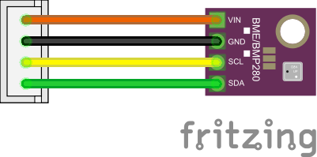

# How to build a Datenzwerg

!!! warning
    
    The Datenzwerg was initially developed for the [CCCamp23](https://events.ccc.de/camp/2023/infos/). Hardware, firmware and models were chosen and designed for a specific purpose and a specific deployment duration and might not be suitable for other use cases. The Datenzwerg is provided as-is without any warranty, and also for now without any plans to improve or fix it or any other support. If you want to build your own Datenzwerg, you are mostly on your own.

## Prerequisites

Building a Datenzwerg requires some soldering and 3D printing skills.

The firmware provided with the Datenzwerg requires you to provide it with credentials for an existing WiFi network (SSID and password) and also access to an [InfluxDB2](https://influxdb.com) instance (host, port, organization id, bucket name and write-enabled access token). You will need to provide these credentials in a file called `secrets.yaml` in the `firmware` directory. A template for this file is provided in `firmware/secrets-template.yaml`.

## Parts

### Electronics

To build your own Datenzwerg, you will need the following parts:

| Count | Item | Function | Link | Price |
| ----- | ---- | -------- | ---- | ----- |
| 1     | Wemos D1 Mini | MCU | [AliExpress](https://aliexpress.com/item/1005004967205772.html) | ~1.70€ |
| 1     | BME280 | Environment Sensor | [AliExpress](https://aliexpress.com/item/1005003676342598.html) | ~2.30€ |
| 1     | TP4056 | Lipo Charger | [AliExpress](https://aliexpress.com/item/32624444293.html) | ~0.50€ |
| 1     | VEML6075 | UV Sensor | [AliExpress](https://aliexpress.com/item/1005004653958045.html) | ~3.00€ |
| 1     | ADS1115 | 4 Port ADC | [AliExpress](https://aliexpress.com/item/32817162654.html) | ~1.70€ |
| 1     | GY-MAX4466 | Sound sensor | [Amazon](https://www.amazon.de/dp/B07YDG3VZF) | ~1.90€ |
| 1     | 5V MT3608 boost converter | Power supply | [AliExpress](https://de.aliexpress.com/item/4001066566291.html) | ~0,40€ |
| 1     | 18650 LiPo battery | Power source | (WIP) | (on hand)[^1] |
| 1     | 18650 LiPo battery holder | Battery holder | [Amazon](https://www.amazon.de/dp/B08Y5R63YB) | ~0.64€ |
| 3     | male 3-pin JST connectors + cables | Sensor & power connectors | [Amazon](https://www.amazon.de/gp/product/B08ZJ6JGB5) | ~0,30€ |
| 1     | male 4-pin JST connectors + cables | I2C connector | [Amazon](https://www.amazon.de/gp/product/B09LCRCTQG) | ~0,20€ |
| 1     | male 2-pin JST cable male + JST cable female | Battery cable | [Amazon](https://www.amazon.de/GTIWUNG-Steckverbinder-Pin-Verbindungsstecker-Connector-Kabeldraht/dp/B07VYR7J49) | ~0,59€ |
| 1     | perfboard | Soldering board | [Amazon](https://www.amazon.de/gp/product/B085WJCRX8/) | ~0,80€ |

Additionally you'll need a soldering iron, solder, some wires and shrink tubing.

!!! warning

    We use BM**E** sensors. They are often mixed up with the BM**P** sensors, which lack the humidity sensor.
    You can identify your module with the help of a picture on this (german) [page](https://homematic-forum.de/forum/viewtopic.php?t=68558).

!!! note

    We recommend using all parts from the BOM. However, if you want to save money, you can directly solder the sensors to the board and save a little bit on the 
    connectors. You can also save a little bit by skipping the TP4056 and soldering the wires directly to the LiPo. Be warned though that this module provides 
    undervoltage protection to the LiPos.

### Gnome body

If you want to put the Datenzwerg into its gnome body, you will also need:

| Count | Item | Function | Link | Price |
| ----- | ---- | -------- | ---- | ----- |
| 1 | 3D printed gnome body top | Gnome body | [Download](https://raw.githubusercontent.com/romses/Datenzwerg/main/models/datenzwerg_40p_1.2mm_top.stl) | ~3€[^2] |
| 1 | 3D printed gnome body bottom | Gnome body | [Download](https://raw.githubusercontent.com/romses/Datenzwerg/main/models/datenzwerg_40p_1.2mm_bottom.stl) | ~0.80€[^2] |
| 6 | 6x1mm neodymium disc magnets | Connecting the top and bottom of the gnome body | [Amazon](https://www.amazon.de/dp/B007JTKX3Y) | ~1.85€ |
| 1 | ~3mm thick sanded and polished cut-off of a 5mm rod of 0A070GT Plexiglas XT | UV transmissive rain cover for the UV sensor | [Sample from the manufacturer](https://www.plexiglas-shop.com/en-de/products/plexiglas-xt/sr0a070gt.html) | ~0.09€ |

For assembly you'll also need hotglue, superglue and UV resin.

!!! note

    It is strongly recommended to print the gnome body with a 0.6mm nozzle and 0.4mm layer height. The model is designed for this combination and might not work with other nozzle sizes or layer heights.

    With such a setup, print both parts with 3 walls, 3 bottom/top layers, 20% infill and tree supports. The top part should take around 5h to print, the bottom part around 1h.

!!! hint

    We got a 100mm sample rod of the Plexiglas XT from the manufacturer for 3€. We cut it to length with a Dremel and [this 3d printed cutting jig](https://www.printables.com/model/113887-rod-and-tube-cutter-for-dremel-with-limiter), then sanded the cut-off smooth with 240 and 400 grit and polished it with a general polishing compound ("Elsterglanz")[^3].

    

## Assembly

### Mainboard

The mainboard is the hardest part to assemble. We recommend to first wire up the 3V3 power trail (orange in the Fritzing drawing) and the GND connections (black), then the I2C trail (green and yellow).
Those are the most complex traces. Next do the 5V connections (red) and finally the analogue signals (cyan).


The Fritzing schematic shows the ESP in its original orientation. However, we decided to mount the ESP flipped over. The diagram also shows the ADS1115 in a rotated orientation. This makes the fritzing 
diagram much easier to understand.

{: style="width:100%"}

The PCB schematic shows the ESP in the correct orientation as well as the ADS1115. This schematic is much closer to our hand soldered boards than shown in the Fritzing diagram.


!!! note
    
    We used a special kind of perfboard. The grouping of three pin holes makes organising the wires so much easier.
    
    

Once you are done soldering up the mainboard, we recommend covering the underside in wide strips of Kapton tape to prevent shorts. Alternatively you may use electric tape.

!!! note

    Things to check after soldering:

    - UV sensor, BME280 and sound sensor are powered by 3V3 coming from the ESP.
    - ADS1115 and ESP are powered by 5V coming from the power supply module.
    - All GNDs are connected.
    - No shorts between any of the pins, especially between neighbouring pins bridges can quickly happen. Use a multimeter to check for shorts.

### Sensors

#### UV and sound sensor

The UV and sound sensors are soldered to JST connector cables to make the sensors replaceable. They share their wiring. Make sure to (carefully!) rotate the potentiometer on the back of the sound sensor to the left-most (clockwise) position, that will set the correct gain of 25x that matches the firmware. Apply shrink tube to protect the soldering joints and reduce the likelihood of shorts.


#### BME280

The BME280 sensor is soldered to a 4-pin JST header. Apply shrink tube to protect the soldering joints and reduce the likelihood of shorts. 




!!! note
    
    The temperature inside the Datenzwerg can become much warmer than the outside temperature. We found that even sticking the BME280 outside of the Datenzwerg, by pushing it through the slot on the bottom of the top of the Datenzwerg case, the temperature readings were still extremely high when the Datenzwerg was in direct sunlight, possibly due to radiation of the heated up plastic of the Datenzwerg body. We decided to live with this issue and just note it in the documentation. A different case design could possibly solve this issue.

### Power supply

The Power supply is the second complex component of the Datenzwerg.

In our original design it was intended to charge the LiPos directly via the TP4056 modules. However, tests have shown that these modules become very hot during charging - we measured up to 86°C, and that was too high for us to
feel good about charging them this way on the possibly very dry field of the CCCamp.

Therefore, we charge the LiPos externally in an off-the-shelf LiPo charger. We however kept the modules to prevent deep discharge.

The BAT+ and BAT- terminals are connected to VIN+ and VIN- of boost converters set to 5V output voltage. Both the ADS1115 and the ESP8266 could be operated with 3V3. However, the TP4056 module supplies battery voltage. Therefore, the easiest way was to boost the voltage to 5V using a boost converter to power both the ESP8266 and the ADS1115. This has also the added advantage of allowing us to measure the battery voltage using the ADS1115, which is able to measure voltages up to Vcc + 0.3V. We therefore connected the third wire of the 3-pin JST header used for the connection to the mainboard to VIN+, with the other two wires connected to VOUT+ and VOUT-.

Shrink tube is applied to protect the soldering joints and reduce the likelihood of shorts.


### Gnome body

Using superglue, glue the magnets into the holes in the gnome body - there are three each on the mating surfaces of top and bottom part. Make sure the polarity is correct, i.e. the magnets attract each other when the gnome body top is placed on the bottom. The magnets should be flush with the surface.

Fit the acrylic rain cover into the hole in the hat. If it won't fit right away, carefully sand the print until it does. It should be flush with the inner surface of the gnome body, it's ok if it protrudes a bit on the front. Carefully - making *really* sure to not get any on the central surface of the acrylic disc - apply UV resin around the edges of the rain cover. Then cure it with a UV lamp. 

!!! warning

    Make sure to not get any UV resin on the surface of the acrylic disc. If you do, it will be permanently fogged up.

Use a small screwdriver or other tool to hold the UV sensor in place with its shrink tubing. Apply hot glue on the shrink tubing and then press the sensor into its final position so that the sensor is centered inside the acrylic window.

Apply hot glue the same way to the shrink tubing of the BME sensor and place it right next to the slot in the lower part of the gnome body top, with the sensor facing downwards.

## Flashing the firmware

Make sure the power is disconnected from the Datenzwerg's mainboard. Unplug the D1 mini from the mainboard and connect it to your computer via USB.

Install Python 3.11. Check out the [GitHub repository](https://github.com/romses/Datenzwerg) and therein run 

1. `python -m venv venv`
2. `source venv/bin/activate`
3. `pip install -r requirements.txt`

This will install all dependencies needed to build the firmware and the documentation into a virtual environment and activate it.

Then, navigate to the `firmware` directory. Copy `secrets-template.yaml` to `secrets.yaml` and fill in your WiFi and InfluxDB2 credentials. Then run

```
esphome -s name <gnome> run datenzwerg.yaml
```

to compile and flash the firmware for your Datenzwerg named `<gnome>` (e.g. if you want to flash the firmware for the gnome named `zwerg`, run `esphome -s name zwerg run datenzwerg.yaml`).

Plug the D1 mini back into the mainboard and reconnect the power. It should connect to your WiFi and start sending data to the configured InfluxDB.

[^1]: We sourced our LiPo batteries from some old USB power banks we happened to have.
[^2]: Assuming a cost of 20€ per kg filament and the suggested print settings, which resulted in around 150g of filament for the top and around 40g for the bottom, the cost of the gnome body is around 4€.
[^3]: We did this by holding the disc with pliers. For sanding, we pressed it against a disc sander on the lowest setting, with the right grit. For polishing, we rubbed it manually again and again on a microfibre cloth with the polishing compound applied, lying on top of a flat hard surface. Don't forget to do both sides!
