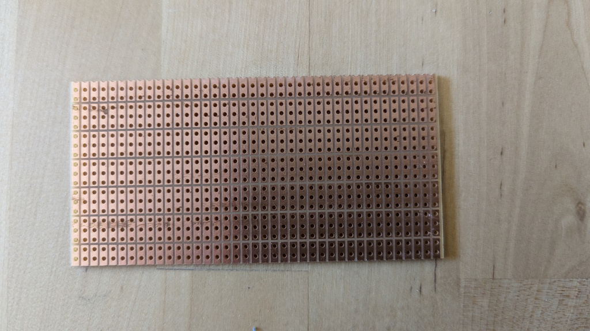
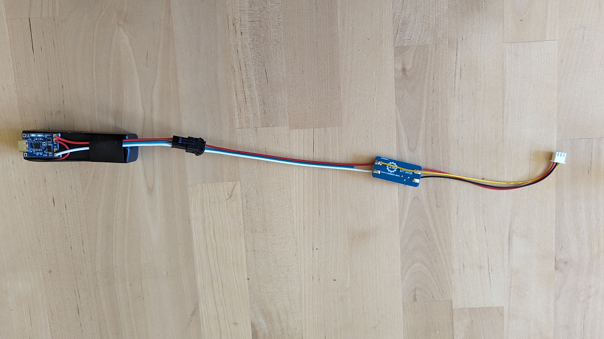

# How to build a Datenzwerg

!!! warning
    
    The Datenzwerg was initially developed for the [CCCamp23](https://events.ccc.de/camp/2023/infos/). Hardware, firmware and models were chosen and designed for a specific purpose and a specific deployment duration and might not be suitable for other use cases. The Datenzwerg is provided as-is without any warranty, and also for now without any plans to improve or fix it or any other support. If you want to build your own Datenzwerg, you are mostly on your own.

## Prerequisites

Building a Datenzwerg requires some soldering and 3D printing skills.

The firmware provided with the Datenzwerg requires you to provide it with credentials for an existing WiFi network (SSID and password) and also access to an [InfluxDB2](https://influxdb.com) instance (host, port, organization id, bucket name and write-enabled access token). You will need to provide these credentials in a file called `secrets.yaml` in the `firmware` directory. A template for this file is provided in `firmware/secrets-template.yaml`.

## Parts

### Electronics

To build your own Datenzwerg, you will need the following parts:

| Count | Item | Function | Link | Price |
| ----- | ---- | -------- | ---- | ----- |
| 1 | Wemos D1 Mini | MCU | [AliExpress](https://aliexpress.com/item/1005004967205772.html) | ~1.70€ |
| 1 | BME280 | Environment Sensor | [AliExpress](https://aliexpress.com/item/1005003676342598.html) | ~2.30€ |
| 1 | TP4056 | Lipo Charger | [AliExpress](https://aliexpress.com/item/32624444293.html) | ~0.50€ |
| 1 | VEML6075 | UV Sensor | [AliExpress](https://aliexpress.com/item/1005004653958045.html) | ~3.00€ |
| 1 | ADS1115 | 4 Port ADC | [AliExpress](https://aliexpress.com/item/32817162654.html) | ~1.70€ |
| 1 | GY-MAX4466 | Sound sensor | [Amazon](https://www.amazon.de/dp/B07YDG3VZF) | ~1.90€ |
| 1 | 5V boost converter | Power supply | (WIP) | (WIP) |
| 1 | 18650 LiPo battery | Power source | (WIP) | (on hand)[^1] |
| 1 | 18650 LiPo battery holder | Battery holder | [Amazon](https://www.amazon.de/dp/B08Y5R63YB) | ~0.64€ |
| 3 | male 3-pin JST connectors | Sensor & power connectors | (WIP) | (WIP) |
| 3 | female 3-pin JST cables | Sensor & power cables | (WIP) | (WIP) |
| 1 | male 4-pin JST connectors | I2C connector | (WIP) | (WIP) |
| 1 | female 4-pin JST cable | I2C cable | (WIP) | (WIP) |
| 1 | male 2-pin JST cable | Battery cable | (WIP) | (WIP) |
| 1 | female 2-pin JST cable | Battery cable | (WIP) | (WIP) |
| 1 | perfboard | Soldering board | [Amazon](https://www.amazon.de/gp/product/B085WJCRX8/) | ~0,80€ |

Additionally you'll need a soldering iron, solder and some wires.

!!! warning
    
    We use BM**E** sensors. They are often mixed up with the BM**P** sensors, which lack the humidity sensor.

### Gnome body

If you want to put the Datenzwerg into its gnome body, you will also need:

| Count | Item | Function | Link | Price |
| ----- | ---- | -------- | ---- | ----- |
| 1 | 3D printed gnome body top | Gnome body | [Download](https://raw.githubusercontent.com/romses/Datenzwerg/main/models/datenzwerg_40p_1.2mm_top.stl) | ~3€[^2] |
| 1 | 3D printed gnome body bottom | Gnome body | [Download](https://raw.githubusercontent.com/romses/Datenzwerg/main/models/datenzwerg_40p_1.2mm_bottom.stl) | ~0.80€[^2] |
| 6 | 6x1mm neodymium disc magnets | Connecting the top and bottom of the gnome body | [Amazon](https://www.amazon.de/dp/B007JTKX3Y) | ~1.85€ |
| 1 | ~3mm thick sanded and polished cut-off of a 5mm rod of 0A070GT Plexiglas XT | UV transmissive rain cover for the UV sensor | [Sample from the manufacturer](https://www.plexiglas-shop.com/en-de/products/plexiglas-xt/sr0a070gt.html) | ~0.09€ |

For assembly you'll also need hotglue, superglue and UV resin.

!!! note

    It is strongly recommended to print the gnome body with a 0.6mm nozzle and 0.4mm layer height. The model is designed for this combination and might not work with other nozzle sizes or layer heights.

    With such a setup, print both parts with 3 walls, 3 bottom/top layers, 20% infill and tree supports. The top part should take around 5h to print, the bottom part around 1h.

!!! hint

    We got a 100mm sample rod of the Plexiglas XT from the manufacturer for 3€. We cut it to length with a Dremel and [this 3d printed cutting jig](https://www.printables.com/model/113887-rod-and-tube-cutter-for-dremel-with-limiter), then sanded the cut-off smooth with 400 grit sandpaper and polished it with a general polishing compound ("Elsterglanz")[^3].

## Assembly

### Mainboard

The Mainboard is the hardest part to assemble. We recommend to first wire the I2C BUS first, followed by the 3V3 (Orange in the fritzing drawing) power trail.
Those are the most complex traces.


!!! note

    The Fritzing schematics shows the ESP in its original orientation. However, we decided to mount the ESP flipped over.
    The Diagram also shows the ADS1115 in a rotated orientation. This makes the fritzing diagram much easier to understanf.

!!! note

    The PCB schematics shows the ESP in the correct orientation as well as the ADS1115. This schematic is much closer to our hand soldered boards than shown in the Fritzing diagram.


!!! note
    
    We used a special kind of perfboard. The grouping of three pin holes makes organising the wires so much easier.
    

### Sensors

#### UV and sound sensor

The UV and sound sensors are soldered to jst connector cables to make the sensors replacable. If you like, you can solder the sensors directly to the PCB.


!!! note
    
    The temperature inside the Datenzwerg can become much warmer than the outside temperature. We found that even sticking the BME280 outside of the Datenzwerg, by pushing it through the slot on the bottom of the top of the Datenzwerg case, the temperature readings were still extremely high when the Datenzwerg was in direct sunlight, possibly due to radiation of the heated up plastic of the Datenzwerg body. We decided to live with this issue and just note it in the documentation. A different case design could possibly solve this issue.

#### BME280

The BME280 sensor is soldered to a 4-pin JST header. 


### Power supply

The Power supply is the second complex component of the Datenzwerg.

In our original design it was intended to charge the LiPos directly via the TP4056 modules. However, tests have shown that these modules become very hot during charging - we measured up to 86°C, and that was too high for us to
feel good about charging them this way on the possibly very dry field of the CCCamp.

Therefore, we charge the LiPos externally. We however kept the modules to prevent deep discharge.

The BAT+ and BAT- terminals are connected to VIN+ and VIN- of boost converters set to 5V output voltage. Both the ADS1115 and the ESP8266 could be operated with 3V3. However, the TP4056 module supplies battery voltage. Therefore, the easiest way was to boost the voltage to 5V using a boost converter to power both the ESP8266 and the ADS1115. This has also the added advantage of allowing us to measure the battery voltage using the ADS1115, which is able to measure voltages up to Vcc + 0.3V. We therefore connected the third wire of the 3-pin JST header used for the connection to the mainboard to VIN+, with the other two wires connected to VOUT+ and VOUT-.




### Gnome body

Using superglue, glue the magnets into the holes in the gnome body - there are three each on the mating surfaces of top and bottom part. Make sure the polarity is correct, i.e. the magnets attract each other when the gnome body top is placed on the bottom. The magnets should be flush with the surface.

Fit the acrylic rain cover into the upper of the two holes, holding it in place from behind with your finger. If it won't fit right away, carefully send the print until it does. It should be flush with the inner surface of the gnome body, it's ok if it protrudes a bit on the front. Carefully - making *really* sure to not get any on the surface of the acrylic disc - apply UV resin around the edges of the rain cover. Then cure it with a UV lamp. 

!!! warning

    Make sure to not get any UV resin on the surface of the acrylic disc. If you do, it will be permanently fogged up.

Use a small screwdriver or other tool to hold the UV sensor in place with its shrink tubing. Apply hot glue on the shrink tubing and then press the sensor into its final position so that the sensor is centered inside the acrylic window.

## Flashing the firmware

Make sure the power is disconnected from the Datenzwerg's mainboard. Unplug the D1 mini from the mainboard and connect it to your computer via USB.

Install Python 3.11. Check out the [GitHub repository](https://github.com/romses/Datenzwerg) and therein run 

1. `python -m venv venv`
2. `source venv/bin/activate`
3. `pip install -r requirements.txt`

This will install all dependencies needed to build the firmware and the documentation into a virtual environment and activate it.

Then, navigate to the `firmware` directory. Copy `secrets-template.yaml` to `secrets.yaml` and fill in your WiFi and InfluxDB2 credentials. Then run

```
esphome -s name <gnome> run datenzwerg.yaml
```

to compile and flash the firmware for your Datenzwerg named `<gnome>` (e.g. if you want to flash the firmware for the gnome named `zwerg`, run `esphome -s name zwerg run datenzwerg.yaml`).

Plug the D1 mini back into the mainboard and reconnect the power. It should connect to your WiFi and start sending data to the configured InfluxDB.

[^1]: We sourced our LiPo batteries from some old USB power banks we happened to have.
[^2]: Assuming a cost of 20€ per kg filament and the suggested print settings, which resulted in around 150g of filament for the top and around 40g for the bottom, the cost of the gnome body is around 4€.
[^3]: This is easiest done by holding the disc with pliers. For sanding, press it against an orbital sander on the lowest setting, with the right grit. For polishing, rub it manually again and again on a microfibre cloth with the polishing compound applied. Don't forget to do both sides!
