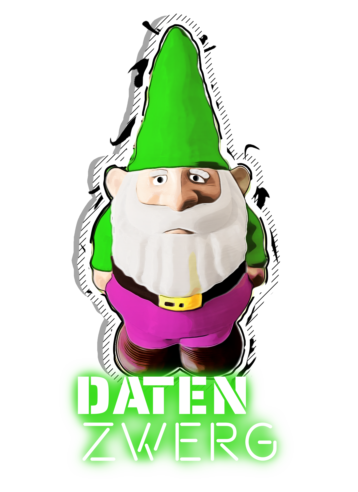

# Der Datenzwerg

## Was ist der Datenzwerg?

{: class="logo" :}

Der Datenzwerg ist ein Gartenzwerg mit einer Mission: Umweltdaten zu sammeln und öffentlich zugänglich zu machen.

Ursprünglich wurde er für das [Chaos Communication Camp 2023](https://events.ccc.de/camp/2023/infos/) entwickelt, 
wo wir ([@romses](https://chaos.social/@romses) und [@foosel](https://chaos.social/@foosel)) eine kleine Armee 
von 10 Datenzwergen über das Camp-Gelände verteilen wollen: Happy, Doc, Grumpy, Dopey, Bashful, Sleepy, Sneezy, 
Nerdy, Kinky und Hefty[^1].

Der Datenzwerg besteht aus einem 3D-gedruckten Gartenzwerg, einer eigenen Platine mit einem ESP8266 D1 Mini Mikrocontroller, einem BME280, UV- und Schallsensor und einer 18650 Batterie. Er wird von [ESPHome](https://esphome.io/) betrieben und sendet seine Daten an eine [InfluxDB](https://www.influxdata.com/) Instanz. Die Firmware zeichnet derzeit Temperatur, relative und absolute Luftfeuchtigkeit, Luftdruck, Taupunkt, UV-Index und Schalldruck auf.

Wir haben ChatGPT gebeten, den Datenzwerg für uns zu beschreiben[^2] und das ist dabei herausgekommen:

> Willkommen in der Welt des Datenzwergs, einem bezaubernden Gartenzwerg mit einem technologischen Twist!
> Diese entzückende kleine Kreatur mag wie eine gewöhnliche Gartendekoration aussehen,
> aber sie birgt eine geheime Mission, die so faszinierend wie wichtig ist.
> Der Datenzwerg ist auf einer Mission, Umweltdaten zu sammeln und sie für das Wohl aller öffentlich zugänglich zu machen.
>
> [...]
>
> Durch die Nutzung seines einzigartigen Standpunktes in Gärten und Außenbereichen
> bietet der Datenzwerg eine beispiellose Perspektive auf die Umwelt um uns herum.
>
> Alle von diesen umweltfreundlichen Wächtern gesammelten Daten werden frei
> über eine intuitive Online-Plattform zur Verfügung gestellt.
>
> [...]
>
> Auf dem kommenden Chaos Communication Camp freuen wir uns, den Datenzwerg einer
> breiteren Öffentlichkeit von Technikbegeisterten, Hackern und Umweltaktivisten vorzustellen.
> Diese außergewöhnliche Verbindung von Natur und Technologie zeigt das Potenzial für
> bürgerschaftliches Umweltmonitoring auf.

## Eine kurze Geschichte des Datenzwergs

2023-06-11
: Die Idee des Datenzwergs wird am letzten Tag der [GPN21](https://entropia.de/GPN21) geboren, kurz vor der gemeinsamen 
  Barschicht von [@romses](https://chaos.social/@romses) und [@foosel](https://chaos.social/@foosel). Die ruhigeren 
  Momente der Barschicht sowie die Rückfahrt ins Rhein-Main-Gebiet werden für die Diskussion der Idee genutzt. Romses 
  registriert eine Domain.

2023-06-30
: Romses und foosel treffen sich für eine gemeinsame Bastelsession. Die ersten zwei Mainboards werden gebaut. Der Datenzwerg lebt!

2023-07-08
: Eine weitere gemeinsame Bastelsession. Weitere 8 Mainboards werden gebaut. Die Datenzwerg-Armee wächst!

2023-07-19
: Nachdem das Modell fertiggestellt und 60+ Stunden gemeinsame Druckzeit vergangen sind, sind alle 10 Datenzwerg-Körper gedruckt.

2023-07-23
: Die Grundinfrastruktur geht live. Sensoren beginnen, an die offiziellen Server unter [datagnome.de](https://datagnome.de) zu berichten.

: Alle Datenzwerg-Körper werden für die Installation ihrer Elektronik vorbereitet: Magnete werden eingeklebt, die UV-durchlässigen Scheiben werden installiert und alle Löcher mit Milliput gefüllt.

2023-07-24
: Die Firmware erreicht einen ersten funktionsfähigen Zustand.

2023-08-15 - 2023-08-19
: Geplanter Datenzwerg Einsatz auf dem [CCCamp23](https://events.ccc.de/camp/2023/infos/).

## Credits & Danksagung

Der Datenzwerg ist ein Gemeinschaftsprojekt von [@romses](https://chaos.social/@romses) und [@foosel](https://chaos.social/@foosel).

Das Datenzwerg-Logo wurde von D.B. entworfen.

Das Datenzwerg-Modell basiert auf [diesem "Garden Gnome" Modell](https://www.printables.com/model/260908-garden-gnome) von [Sci3D](https://www.printables.com/@Sci3D), das unter CC-BY veröffentlicht ist. Unser Remix kann [hier](https://www.printables.com/model/534875-datenzwerg-enclosure) und natürlich auch [im GitHub Repository](https://github.com/romses/Datenzwerg/tree/main/models) gefunden werden.

[^1]: Ja, die letzten drei genannten Namen sind nicht canon, und einer von ihnen gehört sogar einem Schlumpf - na und, Chaos ftw!
[^2]: Prompt: 'Write me a text for a website that gives an overview of the "Datenzwerg". The Datenzwerg is a garden gnome that collects environmental data, and makes it publicly available. The Datenzwerg will be presented at the Chaos Communication Camp.'