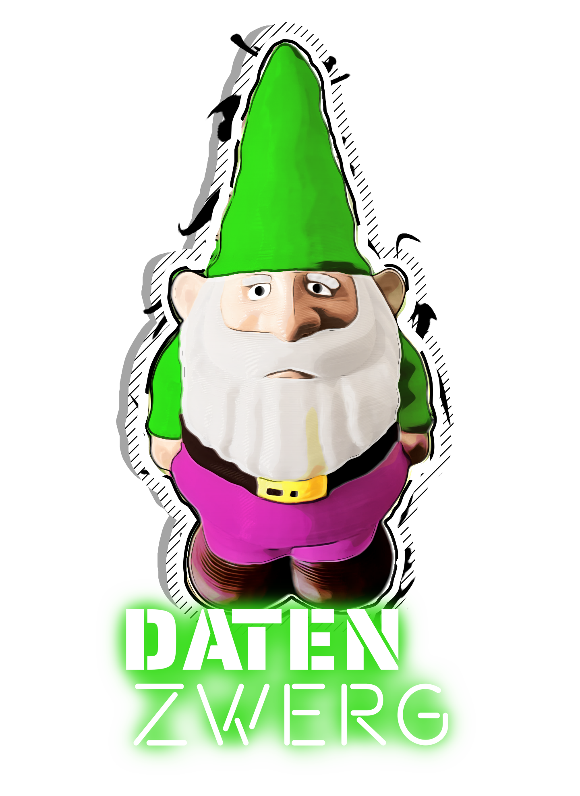

# The Datenzwerg

{: class="logo" :}

!!! tip "Datenzwerg @ CCCamp23"

    You are at CCCamp and came across one of the Datenzwerge? Awesome! Here's some quick links for you:

    - [What is the Datenzwerg?](#what-is-the-datenzwerg)
    - [FAQ](#faq)
    - [Fancy dashboards at grafana.datagnome.de](https://grafana.datagnome.de)

    You can reach us on **DECT 3962 (DZOC)**

    And if you are wondering where each Datenzwerg is located, here's a quick overview. Clicking on the name will take you to the respective dashboard, clicking on the location to the respective map grid:

    | Datenzwerg | Location | Status |
    | ---------- | -------- | ------ |
    | [Bashful](https://grafana.datagnome.de/d/f17a6449-84ed-4733-b982-21c0d480c42a/overview?orgId=1&refresh=15m&var-zwerg=Bashful&theme=dark) | [Observation platform](https://map.events.ccc.de/camp/2023/map/#19/53.031659/13.306303/m=53.031659,13.306303) | Deployed |
    | [Doc](https://grafana.datagnome.de/d/f17a6449-84ed-4733-b982-21c0d480c42a/overview?orgId=1&refresh=15m&var-zwerg=Doc&theme=dark) | [CERT](https://map.events.ccc.de/camp/2023/map/#19/53.029849/13.309139/m=53.029849,13.309139) | Deployed |
    | [Dopey](https://grafana.datagnome.de/d/f17a6449-84ed-4733-b982-21c0d480c42a/overview?orgId=1&refresh=15m&var-zwerg=Dopey&theme=dark) | [N.O.r.T:x](https://map.events.ccc.de/camp/2023/map/#19/53.030413/13.306698/m=53.030413,13.306698) | Deployed |
    | [Grumpy](https://grafana.datagnome.de/d/f17a6449-84ed-4733-b982-21c0d480c42a/overview?orgId=1&refresh=15m&var-zwerg=Grumpy&theme=dark) | TBD | Undeployed |
    | [Happy](https://grafana.datagnome.de/d/f17a6449-84ed-4733-b982-21c0d480c42a/overview?orgId=1&refresh=15m&var-zwerg=Happy&theme=dark) | TBD | Undeployed |
    | [Hefty](https://grafana.datagnome.de/d/f17a6449-84ed-4733-b982-21c0d480c42a/overview?orgId=1&refresh=15m&var-zwerg=Hefty&theme=dark) | [Robo](https://map.events.ccc.de/camp/2023/map/#19/53.032502/13.305729/m=53.032502,13.305729) | Deployed |
    | [Kinky](https://grafana.datagnome.de/d/f17a6449-84ed-4733-b982-21c0d480c42a/overview?orgId=1&refresh=15m&var-zwerg=Kinky&theme=dark) | [Kinky Geeks](https://map.events.ccc.de/camp/2023/map/#19/53.0320037/13.3092778/m=53.0320037,13.3092778) | Deployed |
    | [Nerdy](https://grafana.datagnome.de/d/f17a6449-84ed-4733-b982-21c0d480c42a/overview?orgId=1&refresh=15m&var-zwerg=Nerdy&theme=dark)  | [Heaven](https://map.events.ccc.de/camp/2023/map/#19/53.030368/13.304331/m=53.030368,13.304331) | Deployed |
    | [Sleepy](https://grafana.datagnome.de/d/f17a6449-84ed-4733-b982-21c0d480c42a/overview?orgId=1&refresh=15m&var-zwerg=Sleepy&theme=dark) | [VOC Village / c3auti](https://map.events.ccc.de/camp/2023/map/#19/53.031628/13.303804/m=53.031628,13.303804) | Deployed |
    | [Sneezy](https://grafana.datagnome.de/d/f17a6449-84ed-4733-b982-21c0d480c42a/overview?orgId=1&refresh=15m&var-zwerg=Sneezy&theme=dark) | [UFO](https://map.events.ccc.de/camp/2023/map/#19/53.0312232/13.3091625/m=53.0312232,13.3091625) | Deployed |
## What is the Datenzwerg?

The Datenzwerg is a garden gnome with a mission: To collect environmental data and make it publicly available. 

It was originally developed for the [Chaos Communication Camp 2023](https://events.ccc.de/camp/2023/infos/) where we ([@romses](https://chaos.social/@romses) and [@foosel](https://chaos.social/@foosel)) plan to deploy a small army of 10 Datenzwerge across the camp grounds: Happy, Doc, Grumpy, Dopey, Bashful, Sleepy, Sneezy, Nerdy, Kinky and Hefty[^1].

The Datenzwerg consists of a 3D printed gnome body, a custom PCB with an ESP8266 D1 Mini microcontroller board, a BME280, UV and sound sensor and an 18650 battery. It's powered by [ESPHome](https://esphome.io/) and sends its data to an [InfluxDB](https://www.influxdata.com/) instance. The firmware currently logs temperature, relative and absolute humidity, air pressure, dew point, UV index and sound pressure.

We asked ChatGPT to describe the Datenzwerg for us[^2] and this is what it came up with:

> Welcome to the world of the Datenzwerg, an enchanting garden gnome with a technological twist! 
> This delightful little creature may look like your average garden decoration, 
> but it harbors a secret mission that is as intriguing as it is important. 
> The Datenzwerg is on a quest to collect environmental data and make it publicly available for the benefit of all.
> 
> [...]
> 
> By leveraging its unique vantage point in gardens and outdoor spaces, 
> the Datenzwerg provides an unparalleled perspective on the environment around us.
> 
> All the data collected by these pint-sized environmental guardians is made freely 
> available to the public through an intuitive online platform. 
> 
> [...]
> 
> At the upcoming Chaos Communication Camp, we are excited to introduce the Data Gnome to a 
> wider audience of tech enthusiasts, hackers, and environmental advocates. 
> This extraordinary convergence of nature and technology showcases the potential for 
> citizen-driven environmental monitoring. 

## A short history of the Datenzwerg

2023-06-11
: The idea of the Datenzwerg is born at the final day of  [GPN21](https://entropia.de/GPN21), just before a joint bar shift by [@romses](https://chaos.social/@romses) and [@foosel](https://chaos.social/@foosel). 
  Slow parts of the shift as well as the drive back to the Rhein-Main-Area are spent discussing the idea. Romses registers a domain name.

2023-06-30
: romses and foosel meet up for a joint tinkering session. The first two mainboards are built. The Datenzwerg is alive!

2023-07-08
: Another joint tinkering session takes place. Another 8 mainboards are built. The Datenzwerg army is growing!

2023-07-19
: After finalizing the model and followed by 60+ hours of collective print time, all 10 Datenzwerg bodies are printed.

2023-07-23
: The basic infrastructure goes live. Sensors start to report to the official servers at [datagnome.de](https://datagnome.de).

: All Datenzwerg bodies are prepared for getting their electronics installed: Magnets are glued in, the UV transmissive discs are installed and any holes filled with milliput.

2023-07-24
: The firmware reaches a first feature complete state.

2023-07-28
: All Datenzwerge are now in their bodies and are happily sending data.

2023-08-04
: The website reaches a first complete state in both German and English.

2023-08-09
: The sensor data is publicly available via InfluxDB and MQTT.

: The firmware sees final adjustments in preparation for the Camp.

2023-08-11
: The Datenzwerge are offline again, temporarily. Next stop: CCCamp!

2023-08-15 - 2023-08-19
: Planned Datenzwerg deployment at [CCCamp23](https://events.ccc.de/camp/2023/infos/).

## FAQ

### What kind of data does the Datenzwerg collect?

The Datenzwerg contains sensors to collect the following data:

- Temperature
- Relative humidity
- Air pressure
- UV sensor voltage
- Microphone voltage
- Battery voltage
- WiFi signal strength

We calculate dew point and absolute humidity from the temperature and relative humidity values, UV index from the UV sensor's voltage and sound pressure (noise level) from the microphone voltage. The calculations are done in firmware.

### Do you record audio?

No. While there is a microphone inside each Datenzwerg hooked up to the ESP's ADC, we only use it to sample 1s of audio every 5s during the Datenzwerg's 30s wake cycle every 10min, from which we calculate the peak-to-peak voltage and from that the sound pressure on the Datenzwerg itself. The sample rate is way too low and irregular to record any meaningful audio, and the noise on the line vs the 10-bit ADC would make for a bad experience as well if that was our intention. We are not interested in audio, we are interested in noise levels.

### What's the battery life?

In our tests, a Datenzwerg seems to last between three to four days on a single charge of our 18650 LiPos that range from 1600mAh to 2800 mAh. This obviously depends on the cell capacity but also temperature and other environmental factors.

### Why are the measured temperatures that high during the day?

We need to put the gnomes into direct sunlight in order to be able to measure UV index. We tried to get enough airflow inside the gnome body, but sadly the material itself radiates off heat a lot. As such, the temperature readings are distorted under direct sun light.

### Where can I find the data?

Each Datenzwerg sends its data to a central self-hosted InfluxDB instance. The data is then visualized using Grafana. You can find the Grafana dashboards [here](https://grafana.datagnome.de/).

We also provide read-only access to our InfluxDB and MQTT:

  - InfluxDB:
    - Host: `influxdb.datagnome.de`
    - Port: 80
    - Organization: `datagnome`
    - Bucket: `datagnome`
    - Auth token: `5amv72PFZxPmnbUISjntEVxtElDYMhkeofg9Deo1ykO6Zy2XIba_iWPcyxyAp_R0dHsvHm5moE4YBCwxGIEriw==`
  - MQTT:
    - Host: `datagnome.de`
    - Port: 1883
    - User: `cccamp23`
    - Password: `cccamp23`

### Where can I find the source?

Everything can be found in this GitHub repository: [romses/Datenzwerg](https://github.com/romses/Datenzwerg).

### Can I adopt a Datenzwerg after Camp?

We are not sure yet if we want to part with any Datenzwerg. If so we'll announce this here. Should we go forward with adoptions however, we'd like to to have the material costs covered by the new owner (around 20€ per Datenzwerg without batteries).

## Credits & Thanks

The Datenzwerg was created by [@romses](https://chaos.social/@romses) and [@foosel](https://chaos.social/@foosel).

The Datenzwerg logo was created by D.B.

The Datenzwerg model files are based on [this "Garden Gnome" model](https://www.printables.com/model/260908-garden-gnome) by [Sci3D](https://www.printables.com/@Sci3D), released under CC-BY. Our remix can be found [here](https://www.printables.com/model/534875-datenzwerg-enclosure) and of course also [in the GitHub repository](https://github.com/romses/Datenzwerg/tree/main/models).

[^1]: Yes, the last three are not canon, and one of them even is a smurf - so what, chaos ftw!
[^2]: Prompt: 'Write me a text for a website that gives an overview of the "Datenzwerg". The Datenzwerg is a garden gnome that collects environmental data, and makes it publicly available. The Datenzwerg will be presented at the Chaos Communication Camp.'
